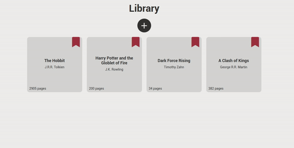
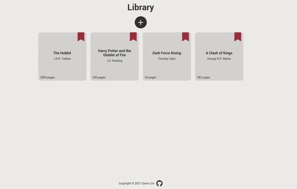
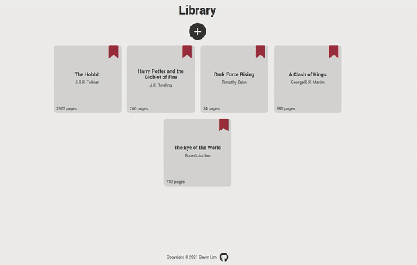
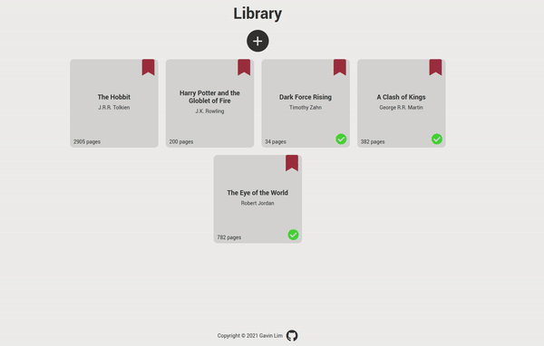
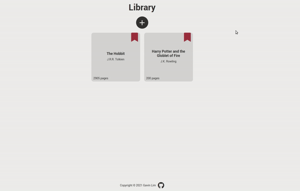

# The Odin Project: Library

Implementation of the Library project from The Odin Project [curriculum](https://www.theodinproject.com/)

[Live Demo](http://gavinslim.com/odin-library/) :point_left:

---

**Overview**

**Adding a new book**

**Changing read status**

**Deleting a book**

**Error message with missing field** 

---

Lessons:
- Use of prototype attribute
- Create a form 
- Ability to add/remove/modify new object
- Create overlay to blur background
- Create a toggle switch
